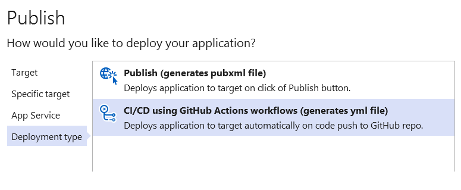
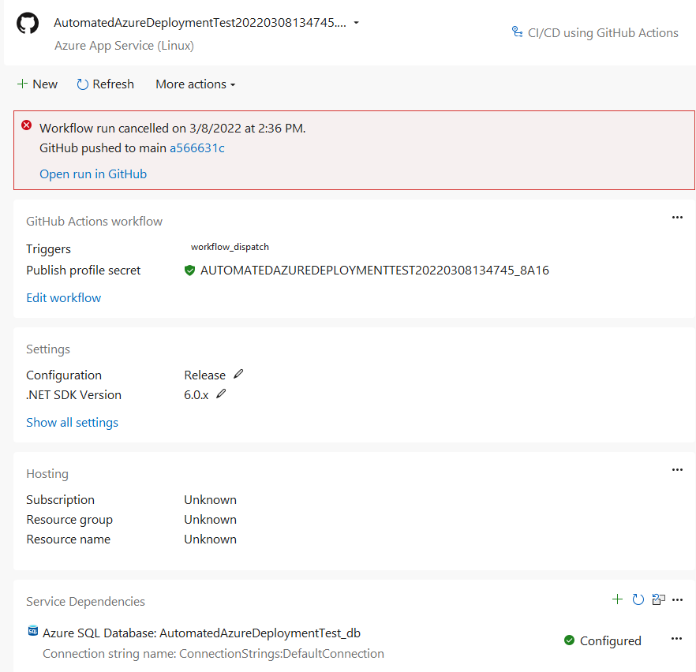

# Automated Azure Deployment Test using GitHub Actions
This repo is used to demonstrate publishing an ASP.NET Core website to Azure using GitHub Actions and Visual Studio 2022. EF Core migrations are used to target an Azure Database.

## Warning
Test thoroughly! Applying migrations on a production database without proper testing is dangerous!

## Process
Initially, publish the website to Azure using Build > Publish, within VS 2022. Choose GitHub Actions as your deployment type when presented with the option.



 VS will create an action (.yml) file and it can be pushed to GitHub.
Afterwards the publish is complete your VS publish will look like:

**ignore the cancelled run portion in red**

```yml
name: Build and deploy .NET Core app to Linux WebApp AutomatedAzureDeploymentTest20220308134745
on:
  push:
    branches:
    - main
env:
  AZURE_WEBAPP_NAME: AutomatedAzureDeploymentTest20220308134745
  AZURE_WEBAPP_PACKAGE_PATH: AutomatedAzureDeploymentTest/publish
  AZURE_WEBAPP_PUBLISH_PROFILE: ${{ secrets.AutomatedAzureDeploymentTest20220308134745_8a16 }}
  CONFIGURATION: Release
  DOTNET_CORE_VERSION: 6.0.x
  WORKING_DIRECTORY: AutomatedAzureDeploymentTest
  # Access the database string secret and store for use in script
  DB_CONNECTION_STRING: ${{ secrets.DatabaseConnectionString }}
jobs:
  build-and-deploy:
    runs-on: ubuntu-latest
    steps:
    - uses: actions/checkout@v2
    - name: Setup .NET Core
      uses: actions/setup-dotnet@v1
      with:
        dotnet-version: ${{ env.DOTNET_CORE_VERSION }}
    - name: Restore
      run: dotnet restore "${{ env.WORKING_DIRECTORY }}"
    - name: Build
      run: dotnet build "${{ env.WORKING_DIRECTORY }}" --configuration ${{ env.CONFIGURATION }} --no-restore
    - name: Test
      run: dotnet test "${{ env.WORKING_DIRECTORY }}" --no-build
    - name: Publish
      run: dotnet publish "${{ env.WORKING_DIRECTORY }}" --configuration ${{ env.CONFIGURATION }} --no-build --output "${{ env.AZURE_WEBAPP_PACKAGE_PATH }}"
    - name: Deploy to Azure WebApp
      uses: azure/webapps-deploy@v2
      with:
        app-name: ${{ env.AZURE_WEBAPP_NAME }}
        package: ${{ env.AZURE_WEBAPP_PACKAGE_PATH }}
        publish-profile: ${{ env.AZURE_WEBAPP_PUBLISH_PROFILE }}
    # You will have to add this Run Code First Migration Section
    - name: Run Code First Migrations
      run: |
        dotnet new tool-manifest
        dotnet tool install --global dotnet-ef
        dotnet tool restore
        dotnet ef database update -p AutomatedAzureDeploymentTest --connection "${{ env.DB_CONNECTION_STRING }}"
    - name: Publish Artifacts
      uses: actions/upload-artifact@v1.0.0
      with:
        name: webapp
        path: ${{ env.AZURE_WEBAPP_PACKAGE_PATH }}
```
Modify the workflow (.yml) file and include the Run Code First Migrations step. Make sure you change the "AutomatedAzureDeploymentTest" to your project name.

Next we will place the database connection string into GitHub Secrets. On GitHub, navigate to Settings > Secrets > Actions and click the "New repository secret" button.
The secret name must match the env variable secret name. In the script above it is ${{ secrets.DatabaseConnectionString }}. The secret would be called "DatabaseConnectionString" and the value would be whatever your target database connection string is that your EF Database Context would need to use

## Resources
The publish profile can also be downloaded directly from Azure
https://github.com/Azure/actions-workflow-samples/blob/master/assets/create-secrets-for-GitHub-workflows.md

If there is an error about Kudu URL during publishing the site
https://stackoverflow.com/questions/64518967/azure-github-app-deployment-error-publish-profile-does-not-contain-kudu-url
